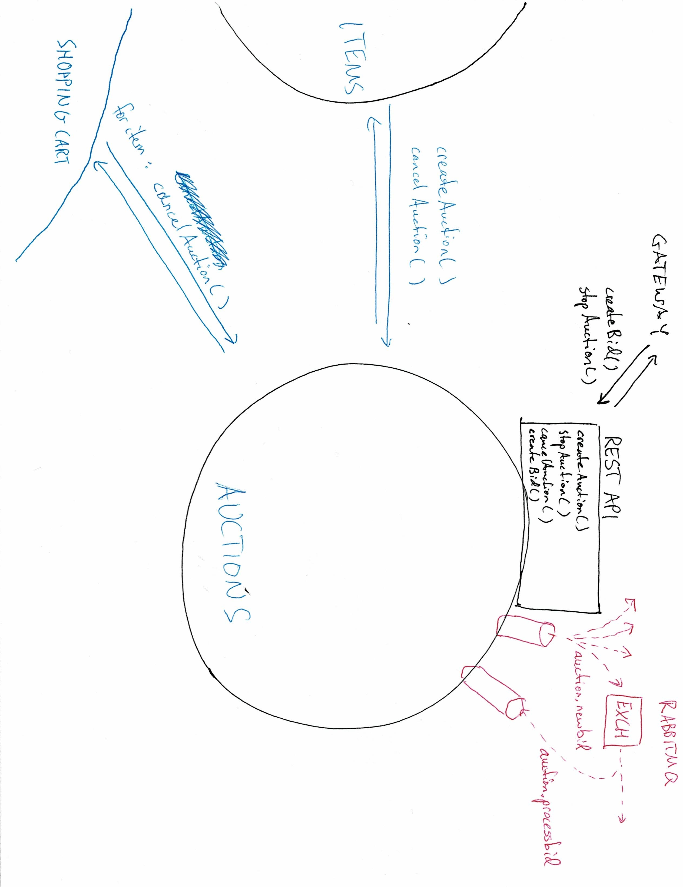
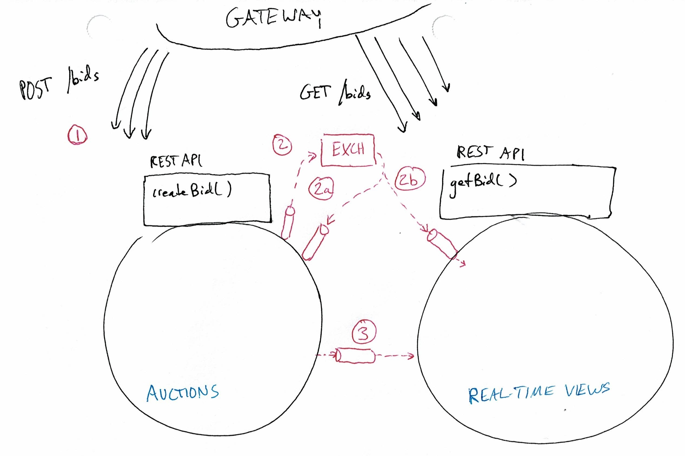

# team `TMACs`: Webay

# installation (backend+gateway)

`project-deploy` is a git repository that is sufficient for deploying the application. It contains scripts to clone the other repositories, build images based on those repositories, and orchestrate application startup (`docker-compose`).

1. git clone this repository:
```
$ git clone https://github.com/MPCS51205-TMACs/project-deploy
```

2. cd into `project-deploy`. there will be a scripts directory containing bash scripts. execute these scripts in order
```
$ . scripts/set-env-vars.sh
$ . scripts/clone-or-pull-repos.sh
$ . scripts/build-all-images.sh
```
The first script sets environment variables used in future steps. The second script clones the needed repositories. The third script will use the environment variables defined prior, which contain assumed information about paths to various files in the cloned repositories, and will build images from the repositories. This may take some time. If any errors are encountered running `build-all-images.sh`, simply try running it again. In the past this worked occasionally.

3. cd to the `project-deploy`. There is a `docker-compose` file there. Run `docker-compose up -d`. This may build a few more images on the first call to bring up the application.

The above steps should bring up the application.

### occasional bug / helpful to knows after calling docker-compose up -d (look for these)

1. after a call to `docker-compose up -d`, check the health of the `gateway` container by doing `docker logs -ft gateway`. Wait until the maven files have finished downloading. If the logs end with a "tomcat/petty started on port 8080", then it is good. If you encounter a build failure, check the changed files in the gateway repository (do a `git status` within the gateway repository). We noticed that in-between docker-compose files, some times additional configuration files will spawn that cause the build to fail. Delete the files if they appear and restart gateway by: deleting all newly appeared files and running `docker restart gateway`.

2. to see if the whole system is "up" look at the logs of the `auctions-service` container (`docker logs -ft auctions-service`). This container continuously tries to curl 3 other containers before executing its main function. So, you can watch these logs until the log activity comes to a slow.

3. after the auctions-service logs look "fine", do a `docker ps -a` to see if any containers have exited or are restarting. If not, the whole backend is up.

### interface to backend

The whole backend is now accessible by the gateway, which is exposed on localhost port 8080; that is, UI clients will send all requests to `http://localhost:8080/`, and the gateway will reach other containers as necessary.

# installation (UI)

we did not have enough time to dockerize the UI. `npm` must be downloaded locally.

1. git clone the UI repository:
```
$ git clone https://github.com/MPCS51205-TMACs/frontend
```

2. cd into the `frontend/frontend` folder. This is the directory from which calls will be made to start up the UI.

3. download node.js (`npm`): https://nodejs.org/en/download/

4. Now you, you should have an `npm`-like command you can use at the terminal. run the UI in a debug type mode (helpful for interactivity) by running
```
$ npm dev run
```

> note: you may encounter an error about not having a particular package. We did not end up using this package, but it is written as being imported somewhere in the code. We may not remember to delete this import statement by time of submission. So if it has not been deleted then first install the package by doing at the terminal: `npm install vue-splitpane`. the `npm dev run` should work thereafter.

The UI is accessed on https://localhost:3000/ likely.

# Architecture (technical)

client-server relationship between frontend and gateway docker container. microservice architecture of ~7 microservices, which each have an accompanying database container.

* `auctions-service`: golang/postgres (no frameworks). 
* `user-service`: java/postgres (+spring/boot).
* `item-service`: java/postgres (+spring/boot).
* `cam-service` (closed-auction-metrics): python/mongo (no frameworks).
* `shopping-cart-service`: python/mongo (no frameworks).
* `watchlist-service`: java/postgres (+spring/boot).
* `notification-service`: java/postgres (+spring/boot).

# Architecture (logical)

Among the 7 microservices, 3 stand out as major services: `user-service`, `item-service`, `auctions-service`, and 4 take on peripheral roles (`cam-service`, `shopping-cart-service`, `watchlist-service`, `notification-service`)

## `user-service`, `item-service`

`user-service` and `item-service` support major CRUD operations for users and items. A java-based spring/boot framework was used to streamline implementation of the common logic surrounding CRUD. This also helped ensure correctness and agility when changing schema (spring/boot allows users to create databases based on defined Java classes, so changes to domain model do not heavily burden the developer with schema changes at the database level). Postgres was chosen as a database because the schema surrounding users and items was well understood and unlikely to change much anyhow.

Both services publish a handful of messages to RabbitMQ `fanout` style. examples include (there are a handful more):
* `item.counterfeit`
* `item.create`
    * An example of reactivity: `watchlist-service` listens for new items to see if that new item will match the watchlist of any user in the system and if so will invoke the `notification-service` to notify that user.
* `user.create`
    * An example of reactivity: `notification-service` writes down the email of that user. That allows the `notification-service` to not have to talk to the `user-service` to get the user's contact information every time it wanted to alert that user. Consider how many network calls this would be during an active auction where many notifications need to be sent out. Also, it is not critical if the `notification-service` has slightly out-dated information about the user's contact details.
* `user.activation` (e.g. suspend or unsuspend user)
    * An example of reactivity: auctions-service listens to `user.activation` and `user.delete`, and it renders that user's bids for active auctions disabled--ensuring they cannot win any auctions henceforth. An event like `user.activation` indicating a user getting re-activated will re-activate his bids in any active auctions if there are any. `notification-service` may remember to not notify a user if they have suspended their account (so they don't get emails).
    
    
`item-service` implements a large amount of endpoints in order to meet the demands of the overall system to manage and evaluate the state of each item. The `Item` class itself contains a rich amount of information to satisfy different requirements; such as start and end time, price, the seller ID, different states (counterfeit, inappropriate, bought, buyNow), and whether or not it has categories or bookmarks applied. `item-service` also supports different variations on `Item` for a better integration with the `auctions-service` and updating an item with optional fields.
    
`item-service` supports two repositories and corresponding controllers for items and categories with the reason being both require CRUD operations, a persistance of data, and exist in a Many-To-Many relationship (i.e., one item can have many categories and one category can be applied to many items). In conjunction, bookmarks and items exist in a Many-To-One and One-To-Many relationship (i.e., one item can have many bookmarks but only one bookmark can be applied to one item), so bookmarks did not require a separate database but rather a table within the items repository.
    
As mentioned above, `item-service` publishes and subscribes to different queues/exchanges to inform and be informed of changes in the system. Items will listen for a `user.delete` message in order to delete all items from the database that the user was selling and will publish messages for events such as create, update, delete, and marked inappropriate or counterfeit.
    
In conclusion for `item-service`, it offers a large selection of endpoints in order to perform multiple different tasks required by the auction site, but each is protected by JWT authorization/authentication so only valid users and admins may call them through the front end successfully.

## `auctions-service`

`auctions-service` takes on a more autonomous role with lots of computation. It also has to manage many activities in parallel. To match the levels of computational work, we choose a more low-level language with performant built-in parallelism constructs--Golang. For now, we implemented the service with a __coarse-grained parallel implementation__ by putting a `mutex` lock around the service's interface. That is, we spawn multiple goroutines-each responsible to invoke the service at different circumstances, and the mutex lock ensures that there are no race conditions while managing these activities. `auctions-service` has a very small interface. It can be invoked directly through its RESTful API to create (submit) a new bid for an auction, or to cancel/stop/create an auction. 

* submitting of bids is done like so: the gateway sends a POST request to the `auctions-service` create a new Bid. To maximize throughput, the `auctions-service` simply stamps a time on the bid information and publishes it to a rabbitMQ exchange--which it also subscribes to. This activity is handled on one goroutine. Physically concurrently, a separate goroutine is subscribbed the bid creation exchange contained stamped bid data, and is processing those bids. The decision to publish the new bid information rather than process the bid when the request is received is to increase throughput. At auction end, many bids will flood the system, and so there must be a way for the system capture the many bids, and then process them at a rate it can handle. The auction system does this and has the ability to even process bids after the auction has ended (every bid that was published contains the time at which it was received, and the `Auction` domain object is capable of processing that bid based on the time it was received retroactively--i.e. the `Auction` is aware that its state is a function of time and thus can understand its state at any point in time). 
* creation and canceling of Auctions are done from the items-service. `items-service` synchronously invokes the `auctions-service` to create a new auction or cancel an existing one whenever a create item or delete item occurs (creation/deletion of an item succeeds if and only if an accompanied creation/cancellation of an auction is done).

In summary, the `auctions-service` has only 2 methods exposed to the gateway (excluding GET requests): `createBid()` and `stopAuction()`. `createBid()`
is dicussed above, and `stopAuction()` is a more powerful admin-like action. To differentiate `cancelAuction()` and `stopAuction()`: `cancelAuction()` is only approved for the seller of an item or an admin, and the state of the auction must be PENDING (the states of an Auction are PENDING, ACTIVE, OVER, CANCELLED, FINALIZED). `stopAuction()` is only approved for an admin, and the state of the auction must be either PENDING or ACTIVE. Both actions are POST requests since that create a Cancellation object associated (and possessed by) an existing Auction object.

The auctions-service publishes a handful of messages to RabbitMQ. They are a mixture of fanout and direct:
* `auction.end` (contains all finalized auction details)
    * example of reactivity: `cam-service` consumes the data and saves it. Henceforth people can access this service to e.g. analyze this data. `shopping-cart-service` uses this information to execute a `fullCheckout()`, which furthermore contacts `user-service` and `item-service` for involved user and item details. It then sends a request (synchronously through a RESTful API) to mark the items bought at the conclusion. In reality, the better design would be to have shopping cart publish an `item.bought` event, which item-service consumes to mark items bought. `item-service` only cares about whether an item is bought to support queries, so this exchange of information need not be instantaneous.
* `auction.new-high-bid`
    * example of reactivity: `notification-service` emails / notifies the associated bidder(s) involved and the seller 
* `auction.start-soon`
    * example of reactivity: `notification-service` sees the item it needs to send out an alert for. It asks the item-service for all the user_id's who have bookmarked an item. The `notification-service` knows all their emails, and it sends an alert to all of them.
* `auction.end-soon`



> illustration of `auction-service`'s interface. solid lines represent synchronous communication through HTTP requests (to an exposed RESTful API). Red dotted lines indicate asynchronous communication. Not mentioned so far: `shopping-cart-service`'s checkout() operation includes, for each item, a synchronous call to cancel the auction associated with that item (N calls for N items). ShoppingCart already knows the start time of each auction, so it knows before making the calls to the auctions-service that the cancellations can be done (we opted for only being able to "buy now" items if the current time is prior to auction start time). Thus if cancellations fail for any reason, the shopping-cart can still proceed with the transaction. Upon failure, the auction concludes, and if there is a winner, he will not be allowed to buy the item because shopping-cart will see the item has already been bought. Thus, worst case scenario the failure of these calls results in a handful of people wasting their time bidding in an action when the item has already been sold.

auctions-service publishes new bids to an exchange as fanout rather than directly to a queue for itself to support a possible future refactor aimed at providing a `real-time-views` service. This helps create an elastic system capable of high throughput. The idea: the auctions-service will have heavy traffic at the end of an auction to create and process new bids and respond to queries about all the existing bids. By creating a dedicated service for queries, we can approximately half the traffic to the `auction-service` so that it can focus on bid processing, giving a more real-time experience.


> the `real-time-views` service consumes asynchronous messages about incoming bids and about the result of processing bids. It can maintain essentially a sorted table of bids that users can see, and the table can be updated to reflect the state of the bid (received and being processed, approved and official, etc). This allows bidders to react to bids with lower latency because both calls are synchronous and dividing the traffic halves the total process time for a batch of `N` `POST` requests and `N` `GET` requests.

# testing

some microservices have unit tests for e.g. domain layer or database layer type code. Few tests exist for integration. Integration was done through manual inspection of correctness with sequences of requests defined in a large Postman workspace we created. It has workflows of typical system requests in the backend.

See the `documentation` git repository for getting postman related documentation about each services' endpoints.

# persistence

Important note!

* `auctions-service`, `shopping-cart-service`, and `cam-service` will persist their data to the localmachine via the use of docker-volumes. I.e., data does not get destroyed upon deletion/creation of containers (data persists between docker-compose up -d / down calls.)
* the other services only persist data for the life time of the container. these containers will have data persisted between docker-compose start / stop calls, but data gets destroyed when docker-compose down is called. These inconsistencies in data storage is annoying but we did not find time to correct this.

To start all databases from scratch before docker-compose up -d call, delete the docker volumes on the local machine by running `. scripts/clear-dbs.sh`. I.e. delete the docker volumes. When docker-compose up -d is called, these volumes will be created from scratch, and all services will have empty databases.

# developer notes

* stubbed behavior
    * `shopping-cart-service` grabs payment details from the `user-service` in checkout operations. We added user `addresses` to the user schema so that shopping cart can grab that too when it grabs payment information, but we did not have time to get shopping-cart to do anything with that data (stubbed).
    * `notification-service` required a lot of debugging since it is listening to many messages. We did not have the time to incorporate a call where `notification-service` e.g. gets all the users who've bookmarked an item from the `item-service` in order to figure out all the individuals to email. So, we have stubbed this behavior and instead kept track of the "system-wide" notifications. That is, in the UI, every user sees all notifications that in the system.

### `shopping-cart`, `auctions-service`, `item-service`

Near the end of the project, we discovered slight tension between these 3 services with regards to item deletion and user deletion.

__item deletion__: handled like so:
* if deleting an item, `item-service` requests `auctions-service` to cancel the auction associated with the item. Cancelling an auction fails if the auction is active and has a bid or is over/already canceled/finalized. This technically means there is no way to delete an item from the system whose auction is over--since any auction that is over cannot be canceled, and deletion of an item is tied to auction cancellation

__user deletion__: handled like so:
* deleting a user deactivates/activates his bids for any live auctions in the `auction-service`
* deleting a user who has listed items for sale only succeeds if we can delete all his items (possibly changed by time of writing 12/5/2022 3:24 PM CDT?). Since we can only delete an item if we can cancel its auction, if the user has any items for which the auction is over, the user can't be deleted. We may have refactored user deletion by time of writing so that: for each item whose auction has not yet started, we ask auction to cancel that auction, and we proceed to delete those items. For all items he has whose auctions are live or are over (the item may or may not have been bought), then we do not request the associated auction be canceled (it need not be canceled anyway as discussed next).
* in the end, deleting all items associated with a user when we delete them is not a major design flaw. If we delete his items, and they no longer exist, but those items' associated auctions live on, the checkout of those items at auction end will fail. All `auction.end` events will get processed by `shopping-cart-service`, and `shopping-cart-service` will fail to proceed with checkout when it consults with `items-service` and discovers the items do not exist. Thus these issues are not major design flaws but rather contribute to lesser transparency about item/auction state at any time.